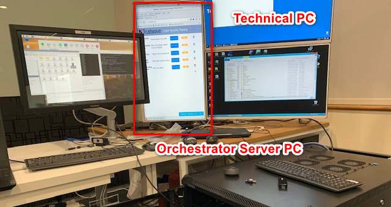

# OT_Platform_Attack_Web

##### Introduction

This project is aim to create a web site server running on the orchestrator PC to provide a web interface to let the user control different cyber attack demos on OT railway module platform and show and show feed back display during the presentation. 

###### Program Running Env



###### Webpage View


###### Attack Work Flow


------

#### Program Setup

###### Development Environment : NodeJs(v12.18.4)/JavaScript HTML5

###### Additional Lib/Software Need :

NodeJs(v12.18.4)

Download and Install NodeJs on Windows: https://www.guru99.com/download-install-node-js.html

######  Hardware Needed : None

###### Program File List :

| Program File       | Execution Env         | Description                                                  |
| ------------------ | --------------------- | ------------------------------------------------------------ |
| node_modules       | Node.js(JavaScript)   | All the additional module which need to import in the app.js |
| public             | HTML, CSS, JavaScript | The main web page interface.                                 |
| app.js             | Node.js(JavaScript)   | Main server program.                                         |
| httpserver.service | sh                    | Auto run setup when running on Linux Platform.               |
| playAlert.sh       | sh                    | Play the alert sound when the attack happens.                |
| runServer.sh       | sh                    | Run the app.js and removed the duplicate running if found.   |


------

##### Program Usage

###### Program execution cmd: 

In the "server" folder, run cmd: 

```
Node app.js
```

Open a web browser and type in link: http://localhost:8080/


------

> Last edit by LiuYuancheng([liu_yuan_cheng@hotmail.com](mailto:liu_yuan_cheng@hotmail.com)) at 14/10/2020