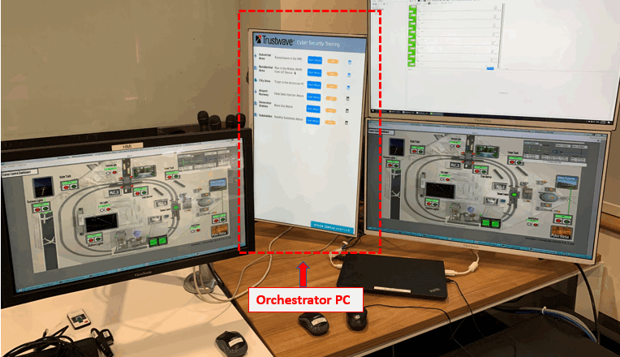
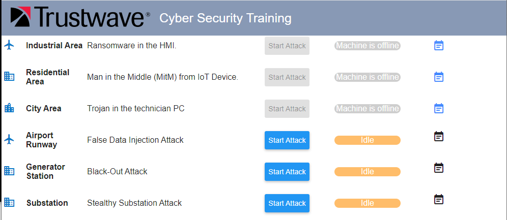
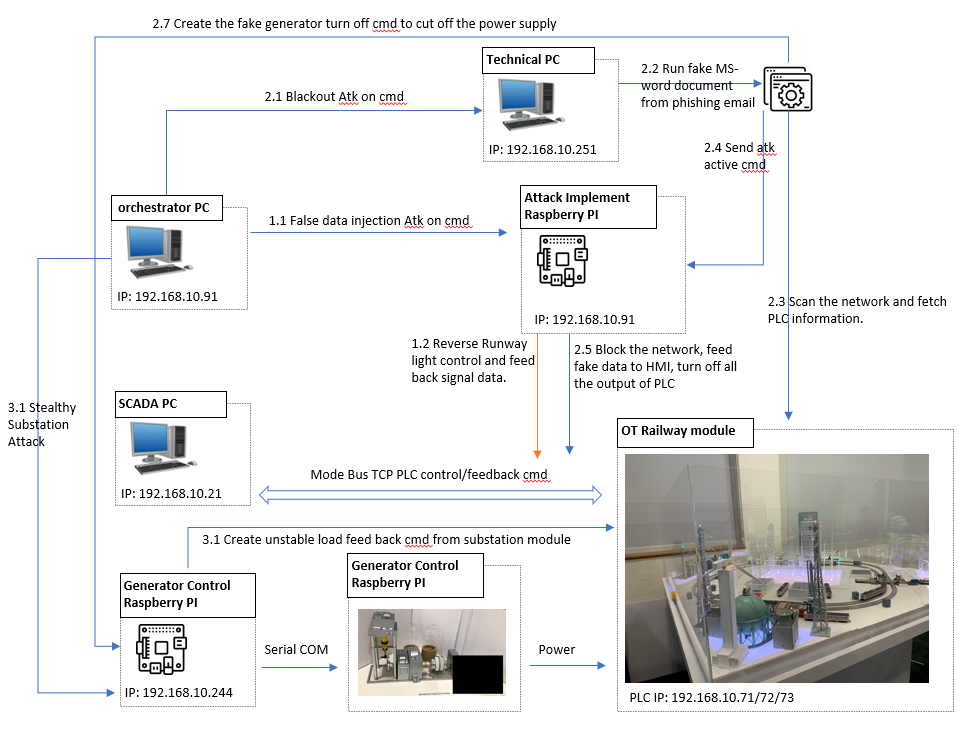
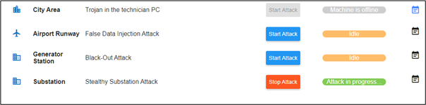

# OT_Platform_Attack_Web

[TOC]

#### Introduction

This project is aim to create a web site server running on the orchestrator PC to provide a web interface to let the user control different cyber attack demos on OT railway module platform and show and show feed back display during the presentation. 

###### Program Running Env



###### Webpage View

Open a web browser on Orchestrator PC and type in URL: http://localhost:8080/: 



###### System Control Flow Diagram 

In our system, the cyber-attack action is implemented the by an attack device (Raspberry PI), the web host will send the control command to the attack device through UDP [port 5005/5006]. The Control Flow Diagram of the System is shown below: 



The Web host program will communicate with the Attack Raspberry PI (section 1.1) and the Generator Control Raspberry PI (section 3.1) by UDP through. When the user pressed the “Start Attack” button, the web host will send the attack activation command to the related agent program running on technical PC or the attack device. After you press the ‘Start Attack’ button, the text on the button will change to ‘Stop Attack’ which means the attack has been activated. The current system state will also show in the progress bar behind the attack control button, as shown in the below image , the program shows the stealthy substation attack is under progressing.



------

#### Program Setup

###### Development Environment : NodeJs(v12.18.4)/JavaScript HTML5

###### Additional Lib/Software Need :

NodeJs(v12.18.4)

Download and Install NodeJs on Windows: https://www.guru99.com/download-install-node-js.html

######  Hardware Needed : None

###### Program File List :

| Program File       | Execution Env         | Description                                                  |
| ------------------ | --------------------- | ------------------------------------------------------------ |
| node_modules       | Node.js(JavaScript)   | All the additional module which needed to import in the app.js |
| public             | HTML, CSS, JavaScript | The main web page interface.                                 |
| app.js             | Node.js(JavaScript)   | Main server program.                                         |
| httpserver.service | sh                    | Auto run setup when running on Linux Platform.               |
| playAlert.sh       | sh                    | Play the alert sound when the attack happens.                |
| runServer.sh       | sh                    | Run the app.js and removed the duplicate running if found.   |

First time setup on a computer: 

1. Copy the server folder to the computer and setup the auto run service during the system boots up: create a new service unit file at **/etc/systemd/system/httpserver.service** with below content. The name of the service unit is user defined and can be any name of your choice.Copy the server folder to the computer and setup the auto run service during the system boot up: 

```
[Unit]
Description=server side for GUI
After=network.target

[Install]
WantedBy=multi-user.target
Alias=webservice.service

[Service]
Type=simple
User=root
Group=root
# Start main service
ExecStart=/home/orchestrator/Attack/server/server/node /home/orchestrator/Attack/server/server/app.js
# Give up if ping don't get an answer
TimeoutSec=20
Restart=always
```

2. Reload the systemd process to consider newly created httpserver.service OR every time when httpserver.service gets modified: 

```
# systemctl daemon-reload
```

3. Enable this service to start after reboot automatically:

```
# systemctl enable httpserver.service
```

4. Start the service:

```
# systemctl start httpserver.service
```

5. Reboot the host to verify whether the scripts are starting as expected during system boot.

```
# systemctl reboot
```

------

##### Program Usage

###### Program execution cmd: 

In the "server" folder, run cmd: 

```
Node app.js
```

Open a web browser and type in link: http://localhost:8080/

------

##### For Developer

Todo:

- [ ] Change to https to make the communicate secure.

The communication detail: 

```
2.2 Attack Control Command All the action trigger commands are sent through UDP under format <ctrlTag>;<parameter> with UTF-8 byte encode. Attack control tag is “A” and the parameter [1, 2,3] specify starting different attack, 0 for stopping attack.
2.2.1 False Data Injection Attack
UDP Channel: Orchestrator PC (192.168.10.90) => Attack Raspberry PI (192.168.10.91) [Port 5005]
UDP Sender program: Orchestrator PC [ /home/orchestrator/Attack/server/server/App.js]
UDP Receiver program: Attack Raspberry PI [/Home/remoteAtk/attackServ.py] UDP message: Start Attack: 'A;2' Stop Attack: ‘A;0.’
2.2.2 Black Out Attack [From App.js to actionServer.py, port:5006]:
Step 1 Open the word doc:
UDP Channel: Orchestrator PC (192.168.10.90) => Technical PC (192.168.10.251) [port 5006]
UDP Sender program: Orchestrator PC [ /home/orchestrator/Attack/server/server/App.js]
UDP Receiver program: Technical PC [ C:\Admin\Documents\remoteAtk\actionServer.py] UDP message: Start Attack: 'A;2' Stop Attack: ‘A;0’
Step2 Start the attack:
UDP Channel: Technical PC (192.168.10.251) => Attack Raspberry PI (192.168.10.91) [Port 5005]
UDP Sender program: Orchestrator PC [C:\Admin\Documents\remoteAtk\attackHost.py]
UDP Receiver program: Attack Raspberry PI [/Home/remoteAtk/attackServ.py] UDP message: Start Attack: 'A;2' Stop Attack: ‘A;0’
2.2.3 Stealthy Substation Attack:
UDP Channel: Orchestrator PC (192.168.10.90) => Generator control Raspberry PI (192.168.10.244) [port:5005]
UDP Sender program: Orchestrator PC [ /home/orchestrator/Attack/server/server/App.js]
UDP Receiver program: Attack Raspberry PI [/Home/GenMgr/src /attackServ.py] UDP message: Start Attack: 'A;3' Stop Attack: ‘A;0.’
2.3 Webpage HTTP Command
The attack control from webpage to web host program is using HTTP get request: WebPage’s JavaScript(server/public/js/index.js) => WebHost (server/App.js)
2.3.1 False Data Injection Attack
Attack start HTTP GET request: “/actions/falseInj_Attack/startAttack”.
Attack stop HTTP GET request: “/actions/falseInj_Attack/stopAttack”.
2.3.2 Black Out Attack
Attack start HTTP GET request: “/actions/ blackOut_Attack/startAttack”.
Attack stop HTTP GET request: “/actions/ blackOut_Attack/stopAttack”.
2.3.3 Stealthy Substation Attack:
Attack start HTTP GET request: “/actions/ sub_Attack/startAttack”.
Attack stop HTTP GET request: “/actions/ sub_Attack/stopAttack”.
```

------

> Last edit by LiuYuancheng([liu_yuan_cheng@hotmail.com](mailto:liu_yuan_cheng@hotmail.com)) at 10/05/2021